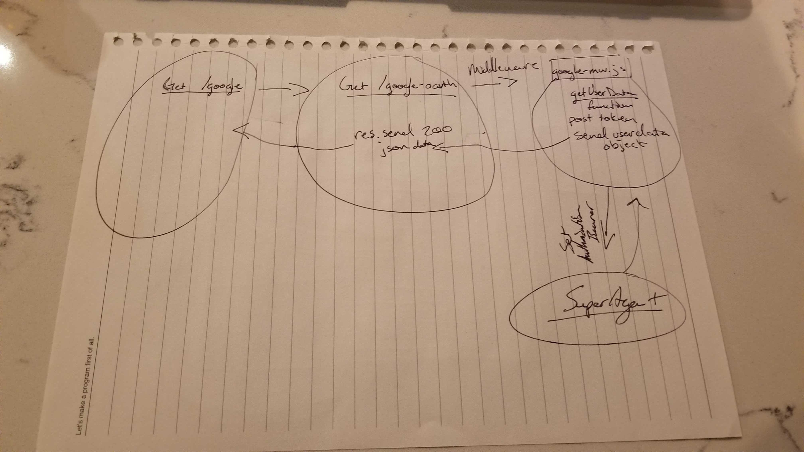

# LAB - Lab 11

### Author: Morgan T Shaw

### Links and Resources
* [submission PR](https://github.com/morgan-401-advanced-javascript/lab11Try2/pull/1)
* [travis](https://travis-ci.com/morgan-401-advanced-javascript/lab11Try2)
* [heroku](https://lab11morgan.herokuapp.com/)

#### Documentation
* [api docs](http://xyz.com) (API servers)
* [jsdoc](http://xyz.com) (Server assignments)

### Setup
#### `.env` requirements
`MONGODB_URI = mongodb://127.0.0.1:27017/app
PORT = 3000
JWT_SECRET = 3a91d829ee92d91c03f94453af275b2a

HOME_URL=http://localhost:3000

GOOGLE_CLIENT_ID=
GOOGLE_CLIENT_SECRET=
GOOGLE_AUTH_SERVICE=https://accounts.google.com/o/oauth2/v2/auth
GOOGLE_TOKEN_SERVICE=https://www.googleapis.com/oauth2/v4/token
GOOGLE_API=https://openidconnect.googleapis.com/v1/userinfo

GITHUB_CLIENT_ID=
GITHUB_CLIENT_SECRET=
GITHUB_AUTH_SERVICE=
GITHUB_TOKEN_SERVICE=
GITHUB_API=`

#### Running the app
* `npm start`

  
#### Tests
* How do you run tests?
npm test
* What assertions were made?
* What assertions need to be / should be made?

#### UML
